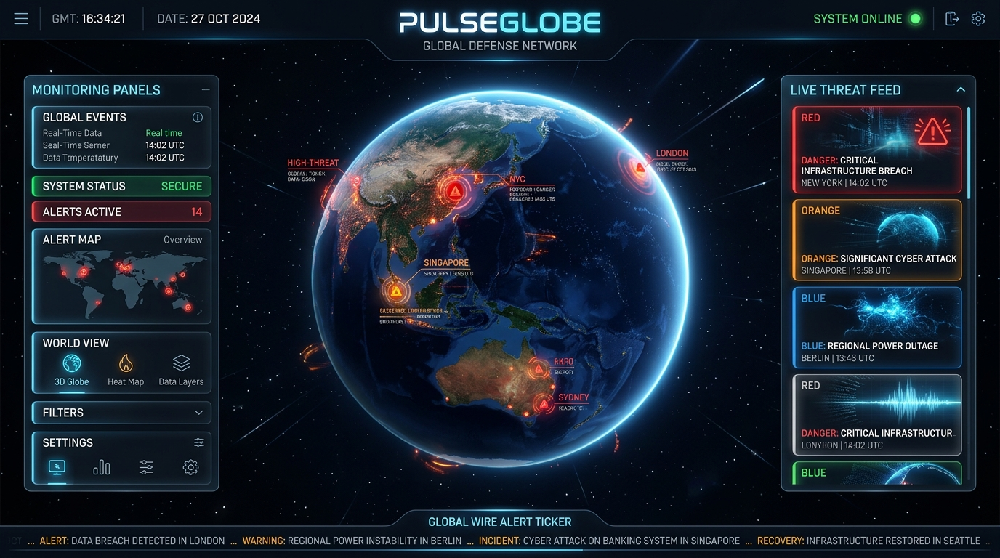

# 🌍 PulseGlobe — Live 3D Earth News & Incident Tracker



**PulseGlobe** is a real-time 3D interactive globe dashboard that visualizes global news, incidents, and threat-level alerts directly on a high-resolution Earth model. Built entirely with **vanilla HTML, CSS, and JavaScript** — no frameworks, no build tools required.

---

## ✨ Features

### 🌐 Interactive 3D Globe
- **NASA HD Satellite Texture** (5400×2700) with automatic CDN fallback
- **Realistic ocean reflections** via specular water map
- **Animated cloud layer** with 128-segment high-poly sphere
- **Custom sunlight & ambient lighting** for natural shadow effects
- **Glowing atmosphere halo** around the Earth
- **Terrain bump mapping** for visible mountain relief
- **Country border polygons** rendered from Natural Earth GeoJSON

### 🏷️ Smart Geographic Labels (Google Earth-style)
- **80+ country labels** covering all continents
- **150+ state/province labels** for India, USA, China, Russia, Japan, Brazil, Australia, Canada, Pakistan, Mexico, South Korea, Germany, France, UK, Turkey, Indonesia, Saudi Arabia, South Africa, Nigeria
- **100+ city labels** spanning every major global city
- **Zoom-based decluttering**: Only one label tier shows at a time (countries → states → cities)
- **Crisp HTML/CSS rendering** — labels stay pixel-perfect at any zoom level

### 📰 Live News Feed
- **Google News RSS** integration via rss2json API
- **Three scope levels**: Local Area, State/Province, Country
- **Threat classification engine** — auto-categorizes news as Danger 🔴, Warning 🟠, or General 🔵
- **Clickable article cards** — every card links to the real source article
- **6-second timeout** with graceful mock fallback

### 🚨 Global Incident Monitor
- **Pre-configured hotspots** with pulsing ring animations on the globe
- **Live ticker bar** scrolling breaking alerts at the bottom
- **Filter by threat level** — click Danger/Warning/General stat cards
- **Hotspot click → news injection**: Clicking a hotspot forces its incident into the live feed

### 🎛️ HUD Controls
- **Search bar** with autocomplete (cities, countries, coordinates)
- **Spin On/Off** toggle for auto-rotation
- **My Location** — fly to your GPS coordinates
- **Night Map** toggle
- **Audio controls** — ambient sounds, click/sonar effects
- **Real-time UTC clock**

### 🎨 Design
- **Glassmorphism panels** with backdrop blur
- **Twinkling parallax starfield** background
- **Nebula glow** ambient effects
- **Smooth micro-animations** throughout
- **Fully responsive** layout

---

## 🚀 Quick Start

### Prerequisites
- A modern web browser (Chrome, Firefox, Edge, Safari)
- A local HTTP server (any of the options below)

### Run Locally

**Option 1 — Python:**
```bash
cd "live news"
python -m http.server 8000
```

**Option 2 — Node.js:**
```bash
npx -y http-server -p 8000
```

**Option 3 — VS Code:**
Install the "Live Server" extension and click "Go Live"

Then open **[http://localhost:8000](http://localhost:8000)** in your browser.

---

## 📁 Project Structure

```
live news/
├── index.html      # Main HTML structure & layout
├── styles.css      # Complete CSS design system (1300+ lines)
├── app.js          # Full application logic (1300+ lines)
├── preview.jpg     # Project preview image
└── README.md       # This file
```

| File | Size | Description |
|------|------|-------------|
| `index.html` | ~8 KB | Semantic HTML5 with HUD layout, sidebars, globe container, audio elements |
| `styles.css` | ~29 KB | Glassmorphism design system, animations, responsive breakpoints, geo-label styles |
| `app.js` | ~70 KB | Globe initialization, label engine, news fetcher, geocoder, hotspot system, audio, search |

---

## 🛠️ Tech Stack

| Technology | Purpose |
|---|---|
| **HTML5** | Semantic structure |
| **Vanilla CSS** | Design system, glassmorphism, animations |
| **Vanilla JavaScript** | All application logic |
| **[Globe.GL](https://globe.gl)** | 3D WebGL globe rendering |
| **[Three.js](https://threejs.org)** | 3D graphics engine (Globe.GL dependency) |
| **[Lucide Icons](https://lucide.dev)** | Modern icon library |
| **[Google Fonts](https://fonts.google.com)** | Inter + Outfit typography |
| **NASA Blue Marble** | High-resolution Earth satellite texture |
| **Natural Earth** | Country boundary GeoJSON polygons |
| **Google News RSS** | Live news feed via rss2json proxy |
| **OpenStreetMap Nominatim** | Reverse geocoding API |

---

## 🌍 Label Coverage

### Countries (80+)
All continents covered — India, USA, China, Russia, Brazil, UK, Germany, France, Japan, Australia, Canada, Mexico, South Africa, Egypt, Argentina, Italy, Spain, Indonesia, Norway, New Zealand, Nigeria, Kenya, Tanzania, Ghana, Algeria, Morocco, UAE, Saudi Arabia, Iran, Turkey, Iraq, South Korea, Vietnam, Thailand, Malaysia, Philippines, Pakistan, Bangladesh, Nepal, Sri Lanka, Afghanistan, Netherlands, Belgium, Switzerland, Poland, Ukraine, Greece, Sweden, Finland, Portugal, Chile, Colombia, Peru, Bolivia, Venezuela, Cuba, and more.

### States/Provinces
- 🇮🇳 **India**: All 28 states + 8 union territories
- 🇨🇳 **China**: 23 provinces including Tibet, Xinjiang, Inner Mongolia
- 🇷🇺 **Russia**: 15 federal subjects from St. Petersburg to Sakha (Yakutia)
- 🇺🇸 **USA**: 20 states from Alaska to Florida
- 🇯🇵 **Japan**: 7 prefectures (Hokkaido, Osaka, Fukuoka, etc.)
- 🇧🇷 **Brazil**: 10 states (São Paulo, Amazonas, Bahia, etc.)
- 🇦🇺 **Australia**: All 7 states & territories
- 🇨🇦 **Canada**: 7 provinces (Ontario, Quebec, BC, Alberta, etc.)
- 🇵🇰 **Pakistan**: 4 provinces
- 🇲🇽 **Mexico**: 5 states
- 🇰🇷 **South Korea**: 4 provinces
- 🇩🇪 **Germany**: 4 states
- 🇫🇷 **France**: 4 regions
- 🇬🇧 **UK**: 4 regions (Scotland, Wales, etc.)
- 🇹🇷 **Turkey**: 4 regions
- 🇮🇩 **Indonesia**: 6 provinces (Java, Bali, Sumatra, etc.)
- 🇸🇦 **Saudi Arabia**, 🇿🇦 **South Africa**, 🇳🇬 **Nigeria**: 3 each

### Major Cities (100+)
Full coverage across India, Americas, Europe, Asia, Africa, Oceania, and the Middle East.

---

## 📡 How It Works

```
User clicks globe / selects hotspot
        ↓
Reverse geocode via Nominatim API → get location name
        ↓
Build Google News RSS query for that location
        ↓
Fetch via rss2json API (6s timeout)
        ↓
Classify each article → Danger / Warning / General
        ↓
Render threat-level cards in right sidebar
        ↓
Update scanner summary stats
```

---

## 📜 License

This project is built for educational purposes. Earth textures are sourced from NASA (public domain) and the three-globe library (MIT).

---

## 👤 Author

Built with ❤️ as part of an internship course project.
